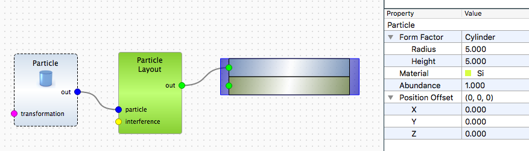

# Exercise 4: particles with size distribution
## Initial parameters

Take sample from the exercise 1. Change the particle form factor to cylinder of 5 nm raius and 5 nm height.



Extend the detector boundaries for $\varphi_f$ from -2 to 2 degree.


## Tasks
1. Add Gaussian size distribution for cylinder radius. Set as mean value 5 nm and as a standard deviation 1.0. Set number of samples to 10 and a sigma factor to 2.
2. Link height to the size distribution. Compare the simulation results. *For the moment, it is possible only in Python.*
3. **Advanced:** create cylinders with independent Gaussian size distribution for height and radius. *For the moment, it is possible only in Python.*

## Available 1D distributions

### Gaussian

The probability density $f(x)$ for Gaussian distribution is defined by the mean value $\mu$ and standard deviation $\sigma$:
$$
f(x) = \frac{1}{\sqrt{2\pi}\sigma}\cdot e^{-\frac{(x-\mu)^2}{2\sigma^2}}
$$

In BornAgain the Gaussian distribution can be set as follows:

```python
# Defining particles with parameter following a distribution
distr_1 = ba.DistributionGaussian(mu, sigma)
par_distr_1 = ba.ParameterDistribution("/Particle/Cylinder/Radius", distr_1, 10, 2.0)
particleDistribution_1 = ba.ParticleDistribution(particle_1, par_distr_1)

```
### Gate
Gate as a uniform distribution set by the range boundaries $a$ (minimum) and $b$ (maximum). The probability density:

$$
f(x) = \frac{1}{b-a}
$$

In BornAgain Python it can be set as:

```python
distr_1 = ba.DistributionGate(x_min, x_max)
```

### Lorentz
Lorentz (Cauchy) probability distribution function $f(x)$ is defined by the median value $\mu$ and half-width at half-maximum $\gamma$:
$$
f(x) = \frac{\gamma}{\pi\cdot(\gamma^2 + (x-\mu)^2)}
$$

In BornAgain Python it can be set as:

```python
distr_1 = ba.DistributionLorentz(mu, gamma)
```

### Log-normal

The probability density $f(x)$ for the Log-normal distribution is defined by the median value $\mu$ and scale parameter $\sigma$:
$$
f(x) = \frac{1}{x\sigma\sqrt{2\pi}}\cdot e^{-\frac{(\ln x-\ln\mu)^2}{2\sigma^2}}
$$

In BornAgain Python it can be set as:

```python
distr_1 = ba.DistributionLogNormal(mu, sigma)
```

### Cosine
The probability density $f(x)$ for the cosine distribution is defined by the mean value $\mu$ and parameter $\sigma$.
$$
f(x) = \frac{1}{2\pi\sigma}\cdot [1+\cos({\frac{x-\mu}{\sigma}})]
$$

In BornAgain Python it can be set as:

```python
distr_1 = ba.DistributionCosine(mu, sigma)
```
