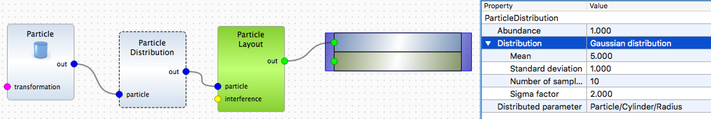

# Exercise 4: particles with size distribution
## Initial parameters

Take sample from the exercise 1. Change the particle form factor to cylinder of 5 nm raius and 5 nm height.


Extend the detector boundaries for $\varphi_f$ from -2 to 2 degree.


## Solutions
### Add Gaussian size distribution for cylinder radius. 


The function to define sample in the Python script will look like:

```python
def getSample():
    # Defining Materials
    material_2 = ba.HomogeneousMaterial("Si", 7.6e-06, 1.7e-07)
    material_1 = ba.HomogeneousMaterial("Air", 0.0, 0.0)

    # Defining Layers
    layer_1 = ba.Layer(material_1)
    layer_2 = ba.Layer(material_2)

    # Defining Form Factors
    formFactor_1 = ba.FormFactorCylinder(5.0 * nm, 5.0 * nm)

    # Defining Particles
    particle_1 = ba.Particle(material_2, formFactor_1)

    # Defining particles with parameter following a distribution
    distr_1 = ba.DistributionGaussian(5.0, 1.0)
    par_distr_1 = ba.ParameterDistribution("/Particle/Cylinder/Radius", distr_1, 10, 2.0)
    particleDistribution_1 = ba.ParticleDistribution(particle_1, par_distr_1)

    # Defining Particle Layouts and adding Particles
    layout_1 = ba.ParticleLayout()
    layout_1.addParticle(particleDistribution_1, 1.0)
    layout_1.setTotalParticleSurfaceDensity(1)

    # Adding layouts to layers
    layer_1.addLayout(layout_1)

    # Defining Multilayers
    multiLayer_1 = ba.MultiLayer()
    multiLayer_1.addLayer(layer_1)
    multiLayer_1.addLayer(layer_2)
    return multiLayer_1
``` 

### Link height to the size distribution. Compare the simulation results.
Linking can be done in the Python script using the following code:

```python
par_distr_1.linkParameter("/Particle/Cylinder/Height")
```
Comparison of the simulation results is shown on the image below.


### **Advanced:** create cylinders with independent Gaussian size distribution for height and radius. 

For the moment, it is possible only in Python. The solution is to populate the particle layout manually.

Let's define a class for Bivariate Gaussian distribution under consideration that radius and height of cylinders are uncorrelated.

```python
import numpy as np


# =========================
# class for 2D Gaussian distribution
# =========================
class BivariateGaussian:
    def __init__(self, mx=0, my=0, sx=0.1, sy=0.1, lower_limit=0.1, upper_limit=1000.0):
        """
        :param mx: mu_x (mean)
        :param my: mu_y (mean)
        :param sx: sigma_x (standard deviation)
        :param sy: sigma_y (standard deviation)
        :param lower_limit: default 0.1 nm (minimal possible particle size)
        :param upper_limit: default 1 micrometer (maximal possible particle size)
        """
        self.mx = mx
        self.my = my
        assert(sx > 0)  # do not consider delta functions
        assert(sy > 0)
        self.sx = sx
        self.sy = sy
        self.ll = lower_limit
        self.ul = upper_limit

    def pdf(self, x, y):
        """
        2D (bivariate) gaussian probability distribution function
        x and y are considered to be uncorrelated
        :param x: x value
        :param y: y value
        :return:
        """
        v1 = ((x - self.mx)/self.sx)**2
        v2 = ((y - self.my)/self.sy)**2
        exponential = np.exp(-0.5*(v1 + v2))
        factor = 2.0*np.pi*self.sx*self.sy
        return exponential/factor

    def adjust_minmax_for_limits (self, vmin, vmax):
        """
        required to avoid unphysical particle sizes
        :param vmin: minimum
        :param vmax: maximum
        :return:
        """
        result_min = vmin
        result_max = vmax
        if vmin < self.ll:
            result_min = self.ll
        if vmax > self.ul:
            result_max = self.ul
        assert (result_min < result_max)  # if not, something goes wrong
        return result_min, result_max

    def gen_values(self, nsamples, sigma_factor):
        """
        can be extended for different nsamples and sigma_factor for x and y
        :param nsamples: number of points
        :param sigma_factor: range
        :return: numpy array of x and y values
        """
        result = np.zeros((2,nsamples))
        xminp = self.mx - sigma_factor*self.sx
        xmaxp = self.mx + sigma_factor*self.sx
        yminp = self.my - sigma_factor*self.sy
        ymaxp = self.my + sigma_factor*self.sy
        xmin, xmax = self.adjust_minmax_for_limits(xminp, xmaxp)
        ymin, ymax = self.adjust_minmax_for_limits(yminp, ymaxp)
        result[0] = np.linspace(xmin, xmax, nsamples)
        result[1] = np.linspace(ymin, ymax, nsamples)
        return result

    def gen_parameters(self, nsamples, sigma_factor):
        """
        generates list of parameters (radius, height, abundance)
        :param values: 2xnsamples array of x=radius and y=height values
        :return: list of dictionaries {'radius':, 'height':, 'abundance':}
        """
        values = self.gen_values(nsamples, sigma_factor)
        norm_factor = 0
        plist = []
        for i in range(nsamples):
            radius = values[0, i]
            for k in range(nsamples):
                height = values[1, k]
                weight = self.pdf(radius, height)
                norm_factor += weight
                plist.append({'radius': radius, 'height': height, 'abundance': weight})
        # normalize
        for i in range(len(plist)):
            plist[i]['abundance'] /= norm_factor
        return plist
```

Then, the function to create sample will look like this.

```python
def getSample():
    # Defining Materials
    material_2 = ba.HomogeneousMaterial("Si", 7.6e-06, 1.7e-07)
    material_1 = ba.HomogeneousMaterial("Air", 0.0, 0.0)

    # Defining Layers
    layer_1 = ba.Layer(material_1)
    layer_2 = ba.Layer(material_2)

    # cylindrical particles with bivariate size distribution
    radius = 5 * nm  # mean radius
    height = radius  # mean height
    nparticles = 10
    nfwhm = 2.0
    sigma = 0.2 * radius  # sx = sy = sigma
    distr = BivariateGaussian(mx=radius, my=height, sx=sigma, sy=sigma)
    params = distr.gen_parameters(nparticles, nfwhm)

    layout_1 = ba.ParticleLayout()
    for p in params:
        cylinder_ff = ba.FormFactorCylinder(p['radius'], p['height'])
        cylinder = ba.Particle(material_2, cylinder_ff)
        layout_1.addParticle(cylinder, p['abundance'])

    # Adding layouts to layers
    layer_1.addLayout(layout_1)

    # Defining Multilayers
    multiLayer_1 = ba.MultiLayer()
    multiLayer_1.addLayer(layer_1)
    multiLayer_1.addLayer(layer_2)
    return multiLayer_1

```
The result of the simulation
