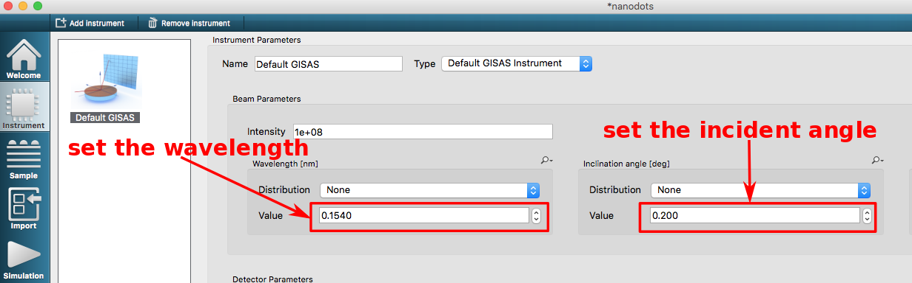
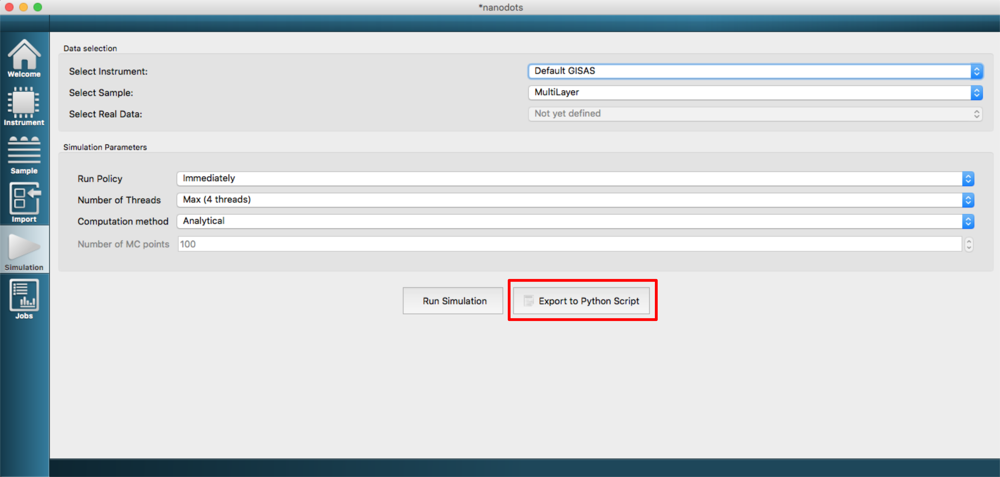
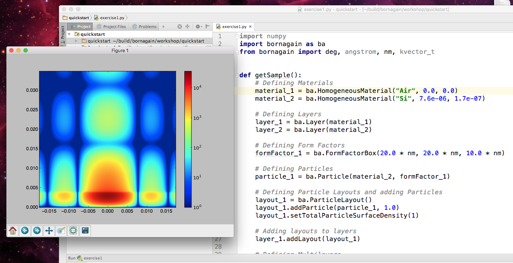

# Exercise 1: Simulate Si nano dots on Si substrate
## Sample simulation parameters

- Beam wavelength $\lambda = 1.54 \overset{\circ}{\text A}$  
- Incident angle $\alpha_i = 0.2 ^{\circ}$
- Index of refraction for Si:  $\,\delta = 7.6\times 10^{-6}$, $\,\beta = 1.7\times 10^{-7}$ 
- Particle shape: box with length = 20 nm, width = 20 nm and height = 10 nm
- No interference between particles


## Solution
### Set the beam parameters


### Define sample


### Create Material Si and assign it to particles and to substrate


### Run simulation


### Change the plot axes to $Q_y,Q_z$, change the color map. Save plot to the file. Review the saved plot.


### Change the particle form factor, run simulation and compare the simulation result to the previous one. Repeat for different form factors.


### Switch to the real time activity. Set and lock $Z$ axis range. Change particle size. See the changes of simulated pattern.


### Switch to the "Simulation" tab. Click `Export to Python Script` and save the script to the directory with your PyCharm project.


### Open the saved Python script in PyCharm. Run simulation.


The code of your Python script should look approximately like this:

```python
import numpy
import bornagain as ba
from bornagain import deg, angstrom, nm, kvector_t

def getSample():
    # Defining Materials
    material_1 = ba.HomogeneousMaterial("Air", 0.0, 0.0)
    material_2 = ba.HomogeneousMaterial("Si", 7.6e-06, 1.7e-07)

    # Defining Layers
    layer_1 = ba.Layer(material_1)
    layer_2 = ba.Layer(material_2)

    # Defining Form Factors
    formFactor_1 = ba.FormFactorBox(20.0*nm, 20.0*nm, 10.0*nm)

    # Defining Particles
    particle_1 = ba.Particle(material_2, formFactor_1)

    # Defining Particle Layouts and adding Particles
    layout_1 = ba.ParticleLayout()
    layout_1.addParticle(particle_1, 1.0)
    layout_1.setTotalParticleSurfaceDensity(1)

    # Adding layouts to layers
    layer_1.addLayout(layout_1)

    # Defining Multilayers
    multiLayer_1 = ba.MultiLayer()
    multiLayer_1.addLayer(layer_1)
    multiLayer_1.addLayer(layer_2)
    return multiLayer_1

def getSimulation():
    simulation = ba.GISASSimulation()
    simulation.setDetectorParameters(800, -1.0*deg, 1.0*deg, 800, 0.0*deg, 2.0*deg)
    
    simulation.setBeamParameters(0.154*nm, 0.2*deg, 0.0*deg)
    simulation.setBeamIntensity(1.0e+08)
    return simulation


def plot(intensities):
    import matplotlib.colors
    from matplotlib import pyplot as plt
    im = plt.imshow(intensities.getArray(), norm=matplotlib.colors.LogNorm(1, intensities.getMaximum()), extent=[-1.0*deg, 1.0*deg, 0.0*deg, 2.0*deg]) 
    plt.colorbar(im)
    plt.show()


def simulate():
    # Run Simulation
    sample = getSample()
    simulation = getSimulation()
    simulation.setSample(sample)
    simulation.runSimulation()
    return simulation.getIntensityData()


if __name__ == '__main__': 
    ba.simulateThenPlotOrSave(simulate, plot)
```
### Change the particle form factors and sizes of particles. Compare simulation results. 

The form factors can be changed in the line 16.
```
formFactor_1 = ba.FormFactorBox(20.0 * nm, 20.0 * nm, 10.0 * nm)
```