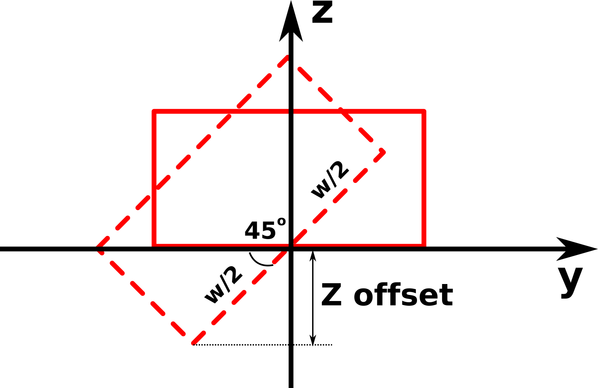
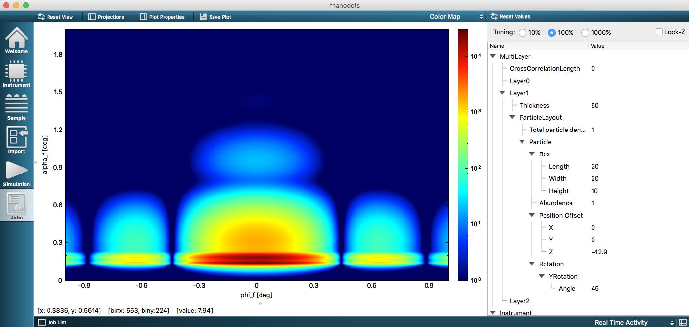

# Exercise 3: particle rotation

## Tasks
Use the sample from exercise2. Particles should be placed on the bottom of the polymer layer.


1. Rotate particles around X axis by 45 degree. Does the particle position need to be adjusted? Set the correct value for the particle position.
2. Repeat the same for Y and Z axes.
3. **Advanced:** Create Euler rotation which turns the particle upside down and rotates it by 30 degree around Z axis. How to represent the same transformation with the set of consequent simple rotations?  Adjust the particle position if needed.

Particle rotation [documentation](http://bornagainproject.org/documentation/usage/scripting/particles_rotation)
 

## Solution
### Rotate particles around X axis by 45 degree


Initial particle position was on the bottom of the polymer layer (-50 nm). Rotation around the X axis has shifted the particle bottom by 0.5 * width * sin(45) = 7.1 nm down. The position need to be adjusted to $Z=-50 + 7.1 = -42.9$ nm to keep particles on the bottom of the layer.



To define a particle rotation in Python, use `RotationX`, `RotationY` or `RotationZ` statement as:

```python
particle_1_rotation = ba.RotationX(45.0*deg)
particle_1.setRotation(particle_1_rotation)
```

The full `getSample()` function will look like:

```python
def getSample():
    # Defining Materials
    material_1 = ba.HomogeneousMaterial("Air", 0.0, 0.0)
    material_3 = ba.HomogeneousMaterial("Si", 7.6e-06, 1.7e-07)
    material_2 = ba.HomogeneousMaterial("Polymer", 1.99999999995e-06, 1.3e-08)

    # Defining Layers
    layer_1 = ba.Layer(material_1)
    layer_2 = ba.Layer(material_2, 50)
    layer_3 = ba.Layer(material_3)

    # Defining Form Factors
    formFactor_1 = ba.FormFactorBox(20.0*nm, 20.0*nm, 10.0*nm)

    # Defining Particles
    particle_1 = ba.Particle(material_3, formFactor_1)
    particle_1_rotation = ba.RotationX(45.0*deg)
    particle_1.setRotation(particle_1_rotation)
    particle_1_position = kvector_t(0.0*nm, 0.0*nm, -42.9*nm)
    particle_1.setPosition(particle_1_position)

    # Defining Particle Layouts and adding Particles
    layout_1 = ba.ParticleLayout()
    layout_1.addParticle(particle_1, 1.0)
    layout_1.setTotalParticleSurfaceDensity(1)

    # Adding layouts to layers
    layer_2.addLayout(layout_1)

    # Defining Multilayers
    multiLayer_1 = ba.MultiLayer()
    multiLayer_1.addLayer(layer_1)
    multiLayer_1.addLayer(layer_2)
    multiLayer_1.addLayer(layer_3)
    return multiLayer_1

```

The result of the simulation:


### Rotate particles around Y axis by 45 degree

Replace X rotation by Y rotation in graphical user interface or in the Python script.

```python
particle_1_rotation = ba.RotationY(45.0*deg)
particle_1.setRotation(particle_1_rotation)
```

Rotation around the Y axis has shifted the particle bottom by 0.5 * length * sin(45) = 7.1 nm down. The position need to be adjusted to $Z=-50 + 7.1 = -42.9$ nm to keep particles on the bottom of the layer.



### Rotate particles around Z axis by 45 degree

Replace X rotation by Y rotation in graphical user interface or in the Python script.

```python
particle_1_rotation = ba.RotationZ(45.0*deg)
particle_1.setRotation(particle_1_rotation)
```

Rotation around the Z axis dies not shift the particle. No position adjustment is needed.


### Euler rotation
To turn the particle upside down and rotate it by 30 degree, Euler rotation with the following angles can be applied:

- $\alpha = -90^{\circ} = 270^{\circ}$
- $\beta = 180^{\circ}$
- $\gamma = 120^{\circ}$

Particle position must be adjusted by the height of the particle: $Z = -50 + 10 = -40$ nm.


In Python:

```python
particle_1_rotation = ba.RotationEuler(-90.0*deg, 180.0*deg, 120.0*deg)
particle_1.setRotation(particle_1_rotation)
particle_1_position = kvector_t(0.0 * nm, 0.0 * nm, -40.0 * nm)
particle_1.setPosition(particle_1_position)
```

The same result can be achieved by combining of the rotation around Y by 180 degree and rotation around Z by 30 degree. For the moment, it is possible only in Python:

```python
particle_1_rotationY = ba.RotationY(180.0 * deg)
particle_1.setRotation(particle_1_rotationY)
particle_1_rotationZ = ba.RotationZ(30.0 * deg)
particle_1.applyRotation(particle_1_rotationZ)
particle_1_position = kvector_t(0.0 * nm, 0.0 * nm, -40.0 * nm)
particle_1.setPosition(particle_1_position)
```